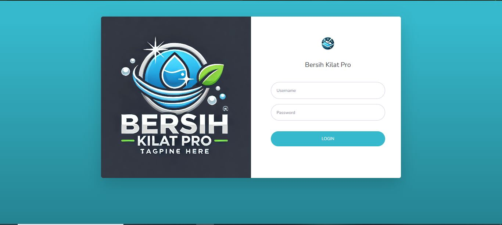
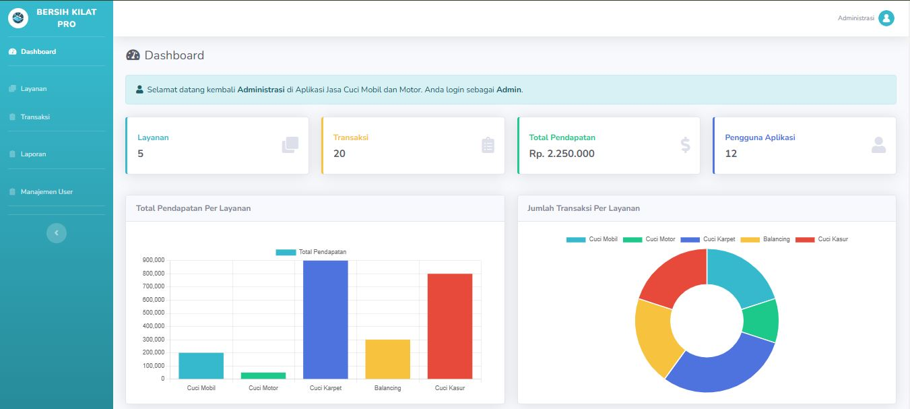
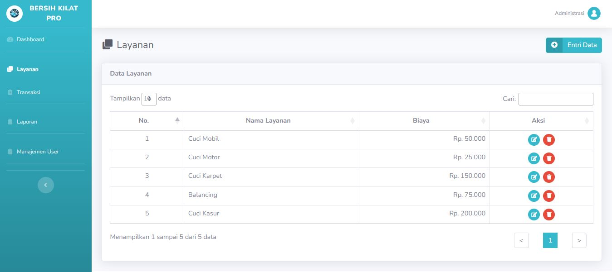
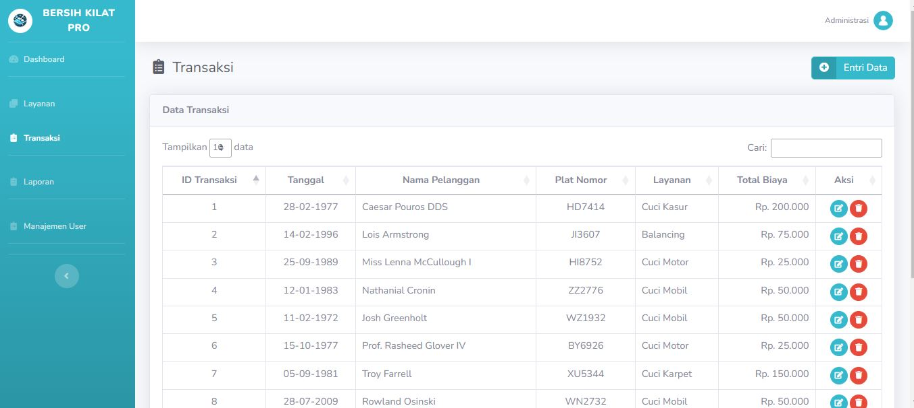

# Aplikasi Bersih Kilat Pro

Selamat datang di aplikasi Bersih Kilat Pro! Aplikasi ini dirancang menggunakan laravel 8 dan php 8 dengan dua peran utama: Admin dan User.

- Admin (username: admin, password: password) 
- User (username: user, password: password)


## Fitur Utama

### Hak Akses Admin

-   **Dashboard**: Akses statistik lengkap seperti jumlah layanan, jumlah transaksi, , total pendapatan, jumlah pengguna, dan grafik.
-   **Manajemen Layanan**: Tambah, lihat, edit, dan hapus data layanan.
-   **Manajemen Transaksi**: Tambah, edit, dan hapus data barang transaksi.
-   **Manajemen Laporan**: Mengunduh laporan.
-   **Manajemen Pengguna**: Tambah, edit, dan hapus data pengguna.

### Hak Akses User

-   **Dashboard**: Akses statistik lengkap seperti jumlah layanan, jumlah transaksi, , total pendapatan, dan grafik.
-   **Layanan**: Tambah, lihat, edit, dan hapus data layanan.
-   **Transaksi**: Tambah, edit, dan hapus data transaksi.


## Screenshots

### Login



### Dashboard



### Layanan



### Transaksi



## Instalasi

Ikuti langkah-langkah di bawah ini untuk menginstal aplikasi ini:

1. Clone repository:

    ```bash
    git clone https://github.com/username/repository.git
    ```

2. Akses direktori proyek:

    ```bash
    cd repository
    ```

3. Install dependensi:

    ```bash
    composer install
    ```

4. Buat file `.env`:

    ```bash
    cp .env.example .env
    ```

5. Generate kunci aplikasi:

    ```bash
    php artisan key:generate
    ```

6. Jalankan migrasi database atau upload db di phpmyadmin:

    ```bash
    php artisan migrate
    ```
     
8. Jalankan srrver:
    ```bash
    php artisan serve
    ```

## Kontribusi

Jika Anda ingin berkontribusi pada proyek ini, silakan fork repository ini, buat branch baru, dan buat pull request dengan deskripsi perubahan yang Anda buat. Terimakasih😊
